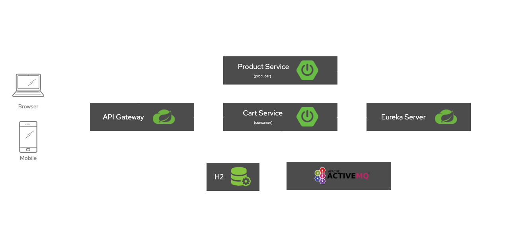

# Welcome to microservices-spring-boot 🚀


[](https://github.com/eduardo-rdguez/microservices-spring-boot/blob/main/README.md)
[](./LICENSE)
[](https://twitter.com/_eduardguez)

> This project has been developed to demonstrate how to build microservices with Spring Boot, Spring Data JPA, Gradle, Groovy, Kotlin, Java, H2 Database, ActiveMQ, Gateway, Eureka Server and Docker Compose.



## Tech Specs 🔖

- Java `8`
- Gradle `7.1.1`
- Spring Boot `2.5.2`
- Spring Data JPA `2.5.2`
- Kotlin `1.5.20`
- Groovy `3.0.8`
- H2 Database `1.4.200`
- ActiveMQ `2.5.2`
- Gateway `3.0.3`
- Eureka Client/Server `3.0.3`
- Docker Compose `3.9`

## Run

Start and run all the background services:

```sh
docker-compose up -d --build
```

## Stop

Stops running containers without removing them. They can be started again with `docker-compose start`:

```sh
docker-compose stop
```

## Down

Stops containers and removes containers, networks, volumes, and images created by `up`:

```sh
docker-compose down --rmi all -v
```

```sh
docker-compose down --rmi local -v
```

## Postman Collection

<https://www.getpostman.com/collections/c44a76b3abacbc43cbda>

## Learn more

- Docker command-line reference: <https://docs.docker.com/compose/reference/>
- Microservices with Spring Boot: <https://spring.io/microservices>

## Author

- Website: <https://eduardo-rdguez.github.io/>
- Twitter: [@\_eduardguez](https://twitter.com/\_eduardguez)
- Github: [@eduardo-rdguez](https://github.com/eduardo-rdguez)
